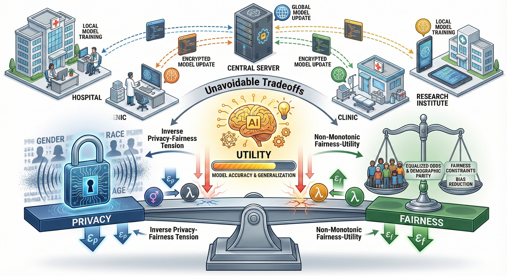
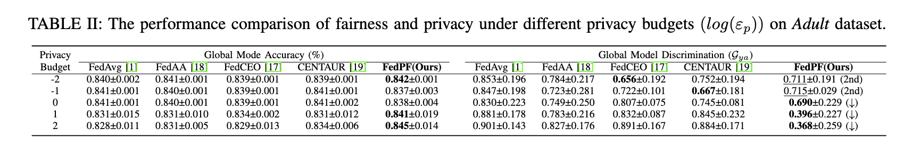
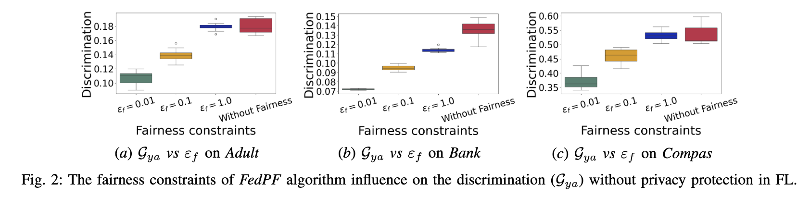
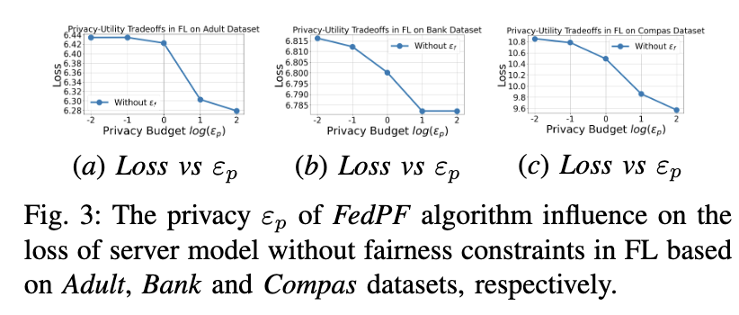
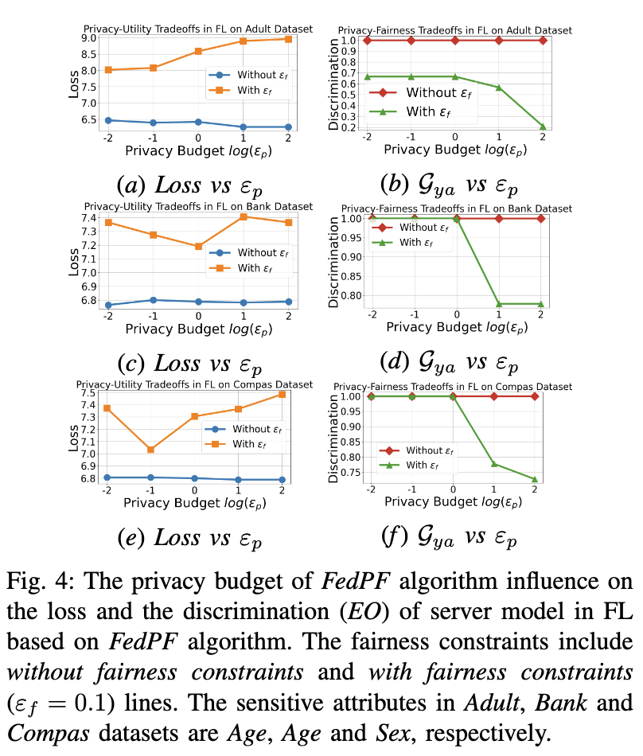

# Accurate Target Privacy Preserving Federated Learning Balancing Fairness and Utility

This paper proposed a private and fair federated learning algorithm (FedPF) with protected sensitive dataset. We study the relationship between fairness, privacy and utility in Federated Learning.

## Abstract

Federated Learning (FL) enables collaborative model training without data sharing, yet participants face a fundamental challenge, e.g., simultaneously ensuring fairness across demographic groups while protecting sensitive client data. We introduce a differentially private fair FL algorithm (\textit{FedPF}) that transforms this multi-objective optimization into a zero-sum game where fairness and privacy constraints compete against model utility. Our theoretical analysis reveals a surprising inverse relationship, i.e., stricter privacy protection fundamentally limits the system's ability to detect and correct demographic biases, creating an inherent tension between privacy and fairness. Counterintuitively, we prove that moderate fairness constraints initially improve model generalization before causing performance degradation, where a non-monotonic relationship that challenges conventional wisdom about fairness-utility tradeoffs. Compared with mainstream algorithms, even under strict privacy constraints, \textit{FedPF} still maintains the lowest discrimination level among all tested algorithms while retaining high utility. Experimental validation demonstrates up to 42.9\% discrimination reduction across three datasets while maintaining competitive accuracy, but more importantly, reveals that the privacy-fairness tension is unavoidable, i.e., achieving both objectives simultaneously requires carefully balanced compromises rather than optimization of either in isolation.



## Table of Contents

- [Installation](#installation)
- [Usage](#usage)
- [Features](#features)
- [Contributing](#contributing)
- [License](#license)

## Installation


```bash
# code
git clone https://github.com/szpsunkk/FedPF.git
cd FedPF
pip install -r requirements.txt
```

## Usage

```bash
# Jupyter templete

./system/federated_exponential_mechanism_adult.ipynb

# or the python code
python system/main.py

```

The comparison with baseline algorithms:

```
./system/compare_adult.ipynb
```

## Results
We consider three scenerios, including fairness metrics, privacy metrics, fairness and privacy metrics.

The templete is in the file `system/federated_exponential_mechanism_adult.ipynb` and `system/federated_exponential_mechanism_bank.ipynb`

### Comparison with Different Baselines
We compare the performance with state-of-the-art benchmark algorithms, including FedAvg, Centaur (ICLR 2023), FedAA (AAAI 2025), and FedCEO (ICML 2025). The results are shown as follows:



### Fairness-Utility Tradeoff

The fairness constraints of FedPF algorithm influence on the discrimination ($\mathcal{G}_{ya}$) without privacy protection in FL.



### Privacy-Utiltiy Tradeoff

The privacy $\varepsilon_p$ of FedPF algorithm influence on the loss of server model without fairness constraints in FL based on \textit{Adult}, \textit{Bank} and \textit{Compas} datasets, respectively.



### Privacy-Fairnee-Utility Tradeoff

The privacy budget of FedPF algorithm influence on the loss and the discrimination (\textit{EO}) of server model in FL based on \textit{FedPF} algorithm. The fairness constraints include \textit{without fairness constraints} and \textit{with fairness constraints} ($\varepsilon_f = 0.1$) lines. The sensitive attributes in \textit{Adult}, \textit{Bank} and \textit{Compas} datasets are \textit{Age}, \textit{Age} and \textit{Sex}, respectively.




## Contributing

Contributions are welcome! Please follow the [contribution guidelines](CONTRIBUTING.md).

## License

This project is licensed under the [MIT License](LICENSE).
