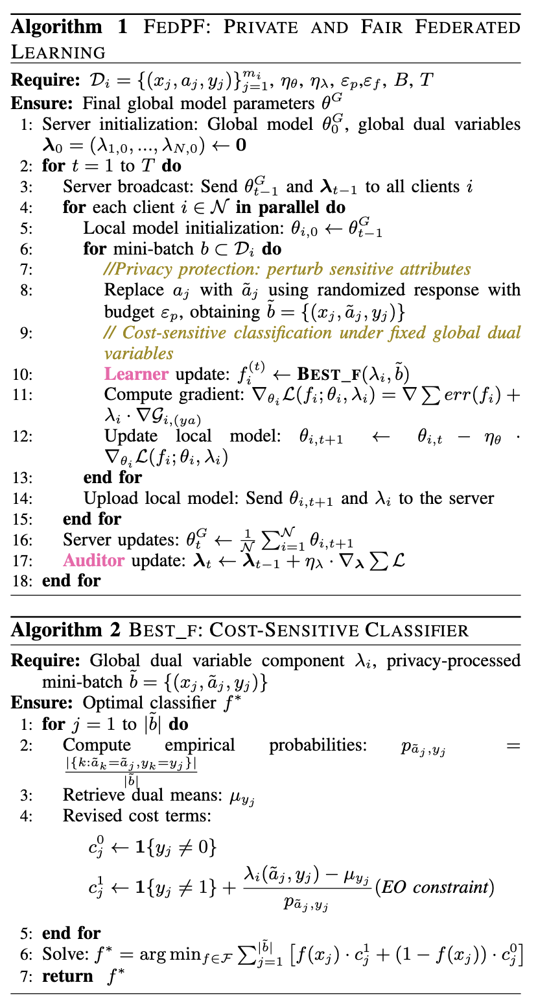

# Accurate Target Privacy Preserving Federated Learning Balancing Fairness and Utility

This paper proposed a private and fair federated learning algorithm (FedPF) with protected sensitive dataset. We study the relationship between fairness, privacy and utility in Federated Learning.

## Abstract

Federated Learning (FL) enables collaborative model training without data sharing, yet participants face a fundamental challenge, e.g., simultaneously ensuring fairness across demographic groups while protecting sensitive client data. We introduce a differentially private fair FL algorithm (FedPF) that transforms this multi-objective optimization into a zero-sum game where fairness and privacy constraints compete against model utility. Our theoretical analysis reveals an inverse relationship: privacy mechanisms that protect sensitive attributes can reduce the statistical power available for detecting and correcting demographic biases under finite samples in federated settings. We further show that our theoretical bounds are consistent with a non-monotonic fairness-utility relationship, which is empirically validated by experiments where moderate fairness constraints improve generalization before excessive enforcement degrades performance. Compared with mainstream algorithms, even under strict privacy constraints, FedPF still maintains the lowest discrimination level among all tested algorithms while retaining high utility. Experimental validation demonstrates up to 42.9\% discrimination reduction across three datasets while maintaining competitive accuracy, but more importantly, reveals that achieving strong privacy and fairness simultaneously requires carefully balanced tradeoffs rather than optimizing either objective in isolation. Furthermore, hardware-level simulations demonstrate that FedPF maintains a low computational footprint, making it suitable for resource-constrained edge devices. The source code for our proposed algorithm is publicly accessible at https://github.com/szpsunkk/FedPF.


## Table of Contents

- [Installation](#installation)
- [Usage](#usage)
- [Features](#features)
- [Contributing](#contributing)
- [License](#license)

## Installation


```bash
# code
git clone https://github.com/szpsunkk/FedPF.git
cd FedPF
pip install -r requirements.txt
```

## Usage

```bash
# Jupyter templete

./system/federated_exponential_mechanism_adult.ipynb

# or the python code
python system/main.py

```

The comparison with baseline algorithms:

```
./system/compare_adult.ipynb
```

For the testbed code, please refer to our [Website](https://ieee-p21451-1-5.github.io/) and [Protocol GitHub code](https://github.com/ieee-p21451-1-5/demo-ncap).

### FedPF Algorithm



## Results
We consider three scenerios, including fairness metrics, privacy metrics, fairness and privacy metrics.

The templete is in the file `system/federated_exponential_mechanism_adult.ipynb` and `system/federated_exponential_mechanism_bank.ipynb`

### Comparison with Different Baselines
We compare the performance with state-of-the-art benchmark algorithms, including FedAvg, Centaur (ICLR 2023), FedAA (AAAI 2025), and FedCEO (ICML 2025). The results are shown as follows:


### Fairness-Utility Tradeoff

The fairness constraints of FedPF algorithm influence on the discrimination ($\mathcal{G}_{ya}$) without privacy protection in FL.


### Privacy-Utiltiy Tradeoff

The privacy $\varepsilon_p$ of FedPF algorithm influence on the loss of server model without fairness constraints in FL based on Adult, Bank and Compas datasets, respectively.


### Privacy-Fairnee-Utility Tradeoff

The privacy budget of FedPF algorithm influence on the loss and the discrimination (EO) of server model in FL based on FedPF algorithm. The fairness constraints include without fairness constraints and with fairness constraints ($\varepsilon_f = 0.1$) lines. The sensitive attributes in Adult, Bank and Compas datasets are Age, Age and Sex, respectively.


## Contributing

Contributions are welcome! Please follow the [contribution guidelines](CONTRIBUTING.md).

## License

This project is licensed under the [MIT License](LICENSE).
