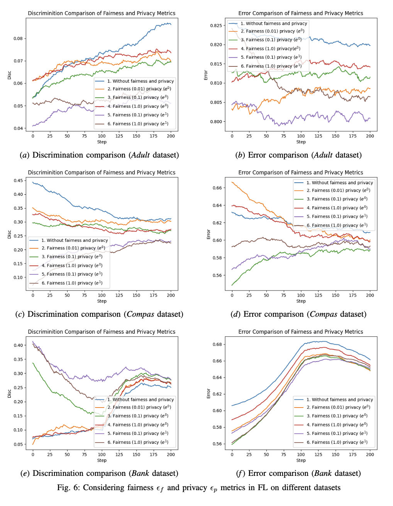

# Balancing the Tightrope: Privacy, Fairness, and Utility in Federated Learning

This paper proposed a private and fair federated learning algorithm (FedPF) with protected sensitive dataset. We study the relationship between fairness, privacy and utility in Federated Learning.

## Table of Contents

- [Installation](#installation)
- [Usage](#usage)
- [Features](#features)
- [Contributing](#contributing)
- [License](#license)

## Installation


```bash
# code
git clone https://github.com/your-repo.git
cd your-repo
pip install -r requirements.txt
```

## Usage

```bash
# code
python main.py
```

## Results
We consider three scenerios, including fairness metrics, privacy metrics, fairness and privacy metrics.

### Fairness Metrics


### Privacy Metrics


### Fairness and Privacy Metrics


## Contributing

Contributions are welcome! Please follow the [contribution guidelines](CONTRIBUTING.md).

## License

This project is licensed under the [MIT License](LICENSE).